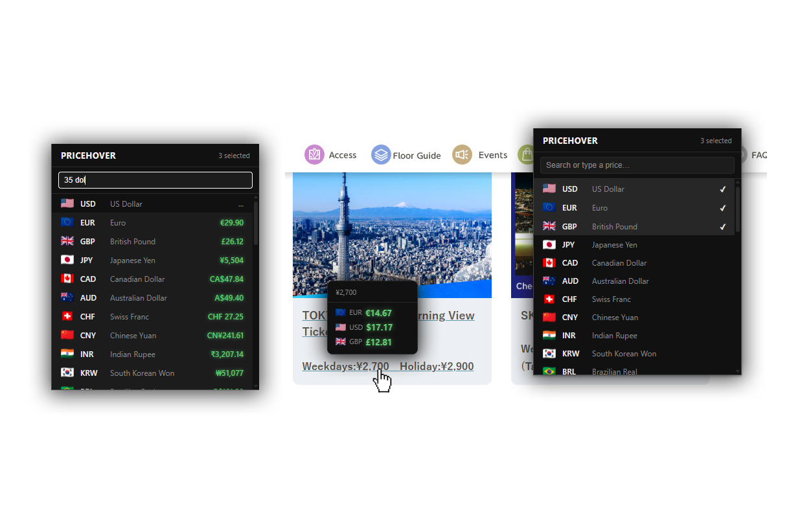

Hover over any price on any webpage — instantly see it converted to your currencies.

## Install

[Chrome Web Store](#) · [Firefox Add-ons](#)

## How it works

- Hover a price → tooltip with conversions appears
- Select text containing a price → same
- Click the extension icon to pick your currencies or use it as a quick converter

Exchange rates update every 24 hours via [open.er-api.com](https://open.er-api.com). No data leaves your browser.

## Build

```bash
bun install
bun run build          # Chrome MV3
bun run build:firefox  # Firefox MV3
```

## Privacy

[Privacy Policy](https://klnuno.github.io/PriceHover/PRIVACY)
