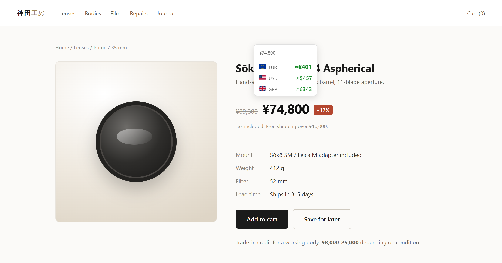

<div align="center">

# PriceHover

Hover over any price on any webpage and instantly see it converted to your currencies.



</div>

## Install

[Chrome Web Store](#) · [Firefox Add-ons](https://addons.mozilla.org/fr/firefox/addon/pricehover)

## How it works

- Hover a price → tooltip with conversions appears. Click a row to copy it.
- Select text containing a price → same
- Click the extension icon for a quick converter, the current site's pause switch, and the settings

## What it does that a regex alone would not

- **Reads `$` in context.** On a `.ca` domain `$49` is Canadian, on `.no` `kr` is Norwegian, on `.cn` `¥` is yuan. The tooltip says when it made that call, and you can turn it off.
- **Understands ranges.** `€10 – €20`, `€10-20` and `10-20 kr` convert as ranges. `€10-20% off` does not.
- **Refuses to guess.** `try 100 times`, `requires PHP 8.2` and `error code 500 KD` are prose, not prices.
- **Inline mode**, off by default: writes your currency beside every price on the page. It only ever appends, never rewrites the site's own text.

Available in English, French, Spanish, German, Brazilian Portuguese, Italian, Japanese and Simplified Chinese.

Exchange rates update every 24 hours via [open.er-api.com](https://open.er-api.com). That is the only host the extension contacts: flags are bundled, prices are detected locally, and nothing about the pages you visit ever leaves your browser.

## Build

```bash
bun install
bun run build          # Chrome MV3
bun run build:firefox  # Firefox MV3
bun test               # detector and rates unit tests
bun run typecheck
```

Regenerating assets (rarely needed, both commit their output):

```bash
bun run icons          # public/icons/*.png
bun run flags          # src/flags.ts, after adding or removing a currency
bun run locales        # public/_locales/*, from the table in scripts/gen-locales.ts
```

## Privacy

[Privacy Policy](https://klnuno.github.io/PriceHover/PRIVACY)
