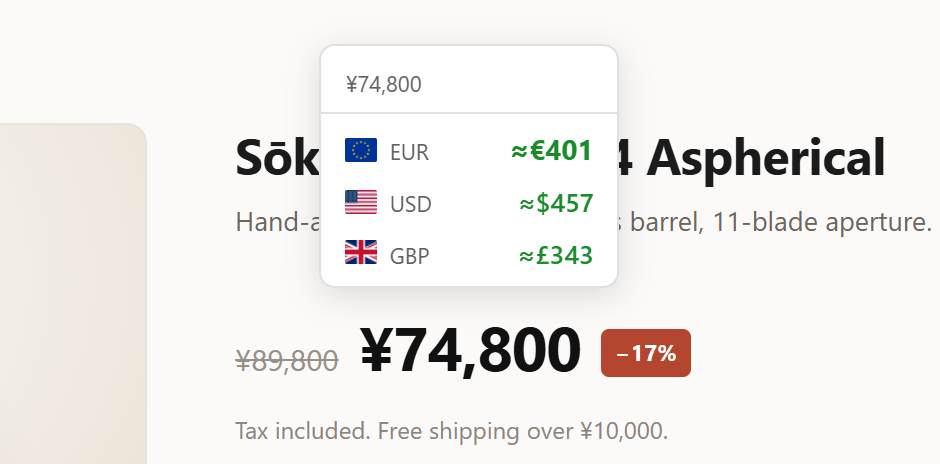

<div align="center">

# PriceHover

**Hover any price on any page and see it in your own currency.**


[Chrome Web Store](#) · [Firefox Add-ons](https://addons.mozilla.org/firefox/addon/pricehover) · [Privacy policy](https://klnuno.github.io/PriceHover/PRIVACY) · [Changelog](CHANGELOG.md)

</div>

---

## Hover a price

Point at it and wait a beat. The tooltip shows your own currency first, then
whatever else you asked for. Click a row to copy the amount.



Selecting text that contains a price does the same thing.

## It reads `$` the way the site means it

`$49` on a `.ca` shop is Canadian dollars, not American. `1 099 kr` on a `.no`
shop is Norwegian krone, not Swedish. `¥` on a `.cn` shop is yuan, not yen.
PriceHover resolves those from the site's domain, or from the region in its
`<html lang>`, and says so in the tooltip when it does.

Domains sold as vanity names — `.co`, `.io`, `.ai`, `.me`, `.tv`, `.to` — are
deliberately ignored, because the country in them means nothing.

Turn it off under **Behaviour** if you would rather `$` always meant USD.

## It knows what is not a price

`try 100 times`, `requires PHP 8.2`, `error code 500 KD`, `see section R 5`,
`Version 5 RM` — all prose, all left alone. Currency matching is case-sensitive
and positional, and every ambiguous token has a rejection test behind it.

Ranges are understood too: `€10 – €20`, `€10-20` and `10-20 kr` convert as
ranges. `€10-20% off` stays a single price and a discount.

## Or skip the hovering entirely

Inline mode writes your currency next to every price on the page. It only ever
*appends* — the site's own text is never rewritten — and it stays out of text
fields, editable areas, `code` and `pre`.


Off by default. Switch it on under **Behaviour**.

## The popup is also a converter

Type `250 chf`, or `20 usd jpy`, or just a number to convert from your own
currency. Your chosen currencies are listed first. The footer tells you how old
the rates are, and refreshes them on demand.

<div align="center">

</div>

The popup also carries the switch that pauses PriceHover on the site you are
currently on, and a master switch for everywhere.

## Settings


Hover delay, rounding, inline mode, per-site pausing, and the order your
currencies appear in.

Rounding is worth a word: a converted price is an estimate, and `€1,234.56`
pretends otherwise. **Smart** drops the digits that stopped meaning anything and
marks the result `≈`.

## Privacy

PriceHover contacts exactly one host, `open.er-api.com`, and asks it one
question: today's exchange rates. That request says nothing about you or about
the page you are on.

- Prices are detected **in the page**, on your machine.
- Country flags are **bundled in the extension**. No image, font or script is
  fetched from a third party while you browse — an image request made from a
  page would hand its host the address of the page you were reading.
- No analytics, no telemetry, no account, no identifier.
- The only permissions are `storage`, `activeTab` (so the popup can name the
  site you are on), and access to `open.er-api.com`.

Full details in the [privacy policy](PRIVACY.md).

## Languages

English, French, Spanish, German, Brazilian Portuguese, Italian, Japanese and
Simplified Chinese. Amounts are formatted in your browser's language too.

## Build

```bash
bun install
bun run dev            # Chrome, hot reload
bun run build          # Chrome MV3  → .output/chrome-mv3
bun run build:firefox  # Firefox MV3 → .output/firefox-mv3
bun test               # unit tests, plus DOM tests under happy-dom
bun run typecheck      # must stay clean
```

Generated files, all committed, none run at build time:

```bash
bun run icons          # public/icons/*.png
bun run flags          # src/flags.ts, after adding or removing a currency
bun run locales        # public/_locales/*, from the table in scripts/gen-locales.ts
```

Releases are cut by pushing a `vX.Y.Z` tag; CI refuses one that disagrees with
`package.json`. Publishing to both stores is done by hand.

## License

[GNU General Public License v3.0 or later](LICENSE).

Use it, read it, fork it. If you distribute a modified version — including
publishing a fork to a browser store — you have to release its source under the
same license. That is the whole point: improvements come back.

```
Copyright (C) 2026 klNuno

PriceHover is free software: you can redistribute it and/or modify it under
the terms of the GNU General Public License as published by the Free Software
Foundation, either version 3 of the License, or (at your option) any later
version.

PriceHover is distributed in the hope that it will be useful, but WITHOUT ANY
WARRANTY; without even the implied warranty of MERCHANTABILITY or FITNESS FOR
A PARTICULAR PURPOSE. See the GNU General Public License for more details.

You should have received a copy of the GNU General Public License along with
this program. If not, see <https://www.gnu.org/licenses/>.
```

Every dependency is GPL-compatible: Svelte and WXT are MIT, TypeScript is
Apache-2.0, resvg is MPL-2.0. Only Svelte ships in the extension.
