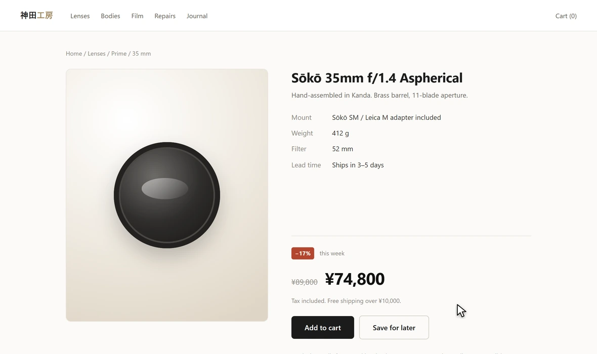
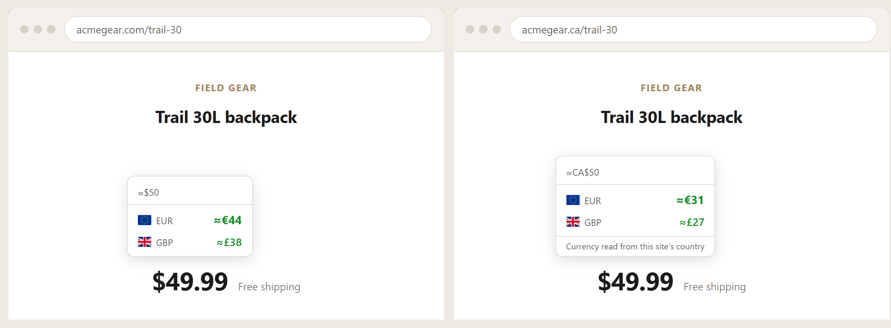
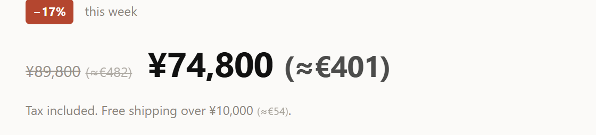
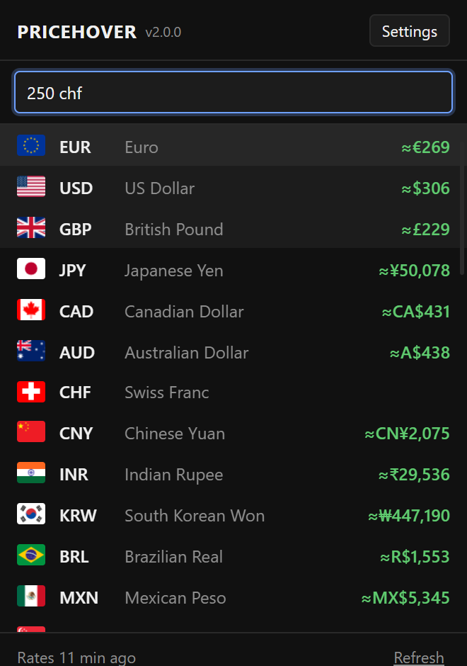
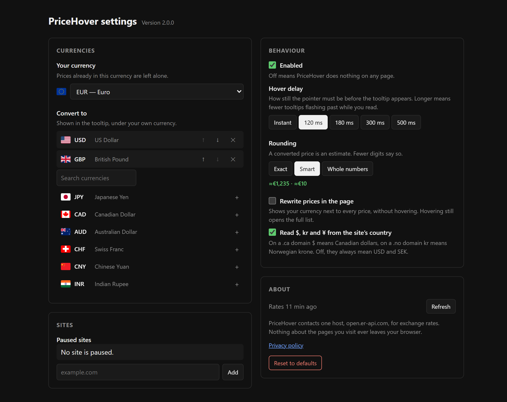

<h1 align="center">PriceHover</h1>
<p align="center">Hover any price on any page and read it in your own currency. Chrome and Firefox, MV3, built with WXT and Svelte 5.</p>

<p align="center">
  
</p>

<p align="center">
  <a href="https://github.com/klNuno/PriceHover/releases"></a>
  <a href="./LICENSE"></a>
  <a href="https://github.com/klNuno/PriceHover/stargazers"></a>
  <a href="https://github.com/klNuno/PriceHover/issues"></a>
  <a href="#install"></a>
  <a href="https://wxt.dev/"></a>
  <a href="https://svelte.dev/"></a>
</p>

> [!NOTE]
> 2.0.0 changed how `$` is read. On a country domain it now converts as that
> country's dollar, not as USD. Settings → **Behaviour** → *Read `$`, `kr` and
> `¥` from the site's country* puts the old reading back.

## Why

A price in a currency you do not think in costs a tab, a search box and your
place in the page. PriceHover reads it where it sits: point at it, wait a beat,
get your own currency. Nothing to paste, no account, and one request a day for
the exchange rates.

## Features

- **Hover or select.** Point at a price for the tooltip, or select text that
  contains one. Your own currency comes first and is never converted away from.
- **`$` means what the site means.** `$49` on a `.ca` shop is Canadian, `1 099 kr`
  on a `.no` shop is Norwegian, `¥` on a `.cn` shop is yuan. The tooltip says
  when it made that call.
- **Prose stays prose.** `try 100 times` and `error code 500 KD` are not prices.
  Matching is case-sensitive and position-aware, and every ambiguous token has a
  rejection test behind it.
- **Ranges.** `€10 – €20`, `€10-20` and `10-20 kr` convert as one range.
- **Click a row to copy.** The tooltip is reachable with the pointer, and a
  click puts the amount on your clipboard.
- **Inline mode.** Write your currency beside every price on the page instead of
  waiting for a hover. It only ever appends.
- **Two switches.** A master one, and a per-site pause you can hit from the
  popup. A misfire on one site is not a reason to uninstall.
- **Rounding.** A conversion is an estimate. `≈€1,235` says so where `€1,234.56`
  pretends otherwise.
- **44 currencies, eight languages.** Amounts are formatted in your browser's
  language, flags are bundled, nothing is fetched from a third party.

## The same `$49.99`, two shops

<p align="center">
  
</p>

The country comes from the domain, or from the region in `<html lang>` when the
domain says nothing. Vanity endings (`.co`, `.io`, `.ai`, `.me`, `.tv`, `.to`)
are deliberately ignored, because the country in them means nothing.

## What it reads, and what it refuses

| On the page | Read as |
| --- | --- |
| `¥74,800` on a `.jp` shop | 74 800 JPY |
| `¥74,800` on a `.cn` shop | 74 800 CNY |
| `1 099 kr` on a `.no` shop | 1 099 NOK |
| `₹1,49,900` | 149 900 INR (Indian lakh grouping) |
| `KD 12.500` | 12.500 KWD (three decimals, not thousands) |
| `€10-20` | a range, 10 to 20 EUR |
| `try 100 times` | nothing |
| `requires PHP 8.2` | nothing |
| `error code 500 KD` | nothing |
| `€10-20% off` | one price, and a discount |

## Inline mode

<p align="center">
  
</p>

Off by default, switched on under **Behaviour**. The site's own text is never
rewritten, only appended to, and text fields, editable areas, `code` and `pre`
are left alone.

## The popup is also a converter

<p align="center">
  
</p>

Type `250 chf`, or `20 usd jpy`, or a bare number to convert from your own
currency. Your chosen currencies are listed first, the footer says how old the
rates are and refreshes them on demand, and the same panel carries the master
switch and the pause for the site you are on.

## Settings

<p align="center">
  
</p>

Your own currency, the list to convert into and its order, hover delay,
rounding, inline mode, per-site pausing, and the age of the rates.

## Privacy

PriceHover contacts exactly one host, `open.er-api.com`, and asks it one
question: today's exchange rates. That request carries nothing about you or
about the page you are on.

- Prices are detected in the page, on your machine.
- Flags are bundled in the extension. No image, font or script is fetched from a
  third party while you browse. An image request made from a page would hand its
  host the address of the page being read.
- No analytics, no telemetry, no account, no identifier.
- Three permissions: `storage`, `activeTab` (so the popup can name the site you
  are on), and access to `open.er-api.com`.

Full details in the [privacy policy](PRIVACY.md).

## Install

- **Firefox**: [addons.mozilla.org](https://addons.mozilla.org/firefox/addon/pricehover).
- **Chrome**: the zip on
  [Releases](https://github.com/klNuno/PriceHover/releases) loads unpacked from
  `chrome://extensions` with developer mode on. The Web Store listing is
  published by hand, so it can trail a tag by a few days.

## Build from source

```bash
bun install
bun run dev            # Chrome, hot reload
bun run build          # Chrome MV3  -> .output/chrome-mv3
bun run build:firefox  # Firefox MV3 -> .output/firefox-mv3
bun run zip            # .output/pricehover-<version>-chrome.zip
```

Checks that must pass before a commit:

```bash
bun test               # unit tests, plus DOM tests under happy-dom
bun run typecheck      # tsc --noEmit, kept clean and enforced in CI
```

Three generated files are committed and none of them run at build time:

```bash
bun run icons          # public/icons/*.png
bun run flags          # src/flags.ts, after adding or removing a currency
bun run locales        # public/_locales/*, from the table in scripts/gen-locales.ts
```

A release is cut by pushing a `vX.Y.Z` tag. CI refuses a tag that disagrees with
`package.json`, builds both targets and attaches the zips. Publishing to the two
stores is done by hand.

## Project structure

```text
entrypoints/
  content.ts            # hover, hitboxes, the tooltip's whole lifecycle
  background.ts         # rate refresh, badge, first-install options page
  popup/ options/       # Svelte 5 apps
src/
  detector.ts           # case-sensitive, position-aware price matching
  locale.ts             # which country a page belongs to, and what $ means there
  convert.ts formatter.ts
  settings.ts           # one storage key, one parser
  inline.ts             # the in-page annotator
  tooltip.svelte tooltip-state.ts
  flags.ts              # generated, flags inlined as data URIs
scripts/                # icons, flags and locales generators
```

## Contributing

Issues and pull requests are welcome. Keep `bun test` and `bun run typecheck`
clean, add a rejection test alongside any new currency token, and never add a
runtime request to a second host.

Detection is the part that breaks quietly. A token accepted one position too
freely turns `error code 500 KD` into a price, so every new one arrives with the
case that must stay silent.

## License

[GNU General Public License v3.0 or later](LICENSE).

Use it, read it, fork it. Distributing a modified version, publishing a fork to
a browser store included, means releasing its source under the same license.
That is the point: improvements come back.

```
Copyright (C) 2026 klNuno

PriceHover is free software: you can redistribute it and/or modify it under
the terms of the GNU General Public License as published by the Free Software
Foundation, either version 3 of the License, or (at your option) any later
version.

PriceHover is distributed in the hope that it will be useful, but WITHOUT ANY
WARRANTY; without even the implied warranty of MERCHANTABILITY or FITNESS FOR
A PARTICULAR PURPOSE. See the GNU General Public License for more details.

You should have received a copy of the GNU General Public License along with
this program. If not, see <https://www.gnu.org/licenses/>.
```

Every dependency is GPL-compatible: Svelte and WXT are MIT, TypeScript is
Apache-2.0, resvg is MPL-2.0. Only Svelte ships inside the extension.
